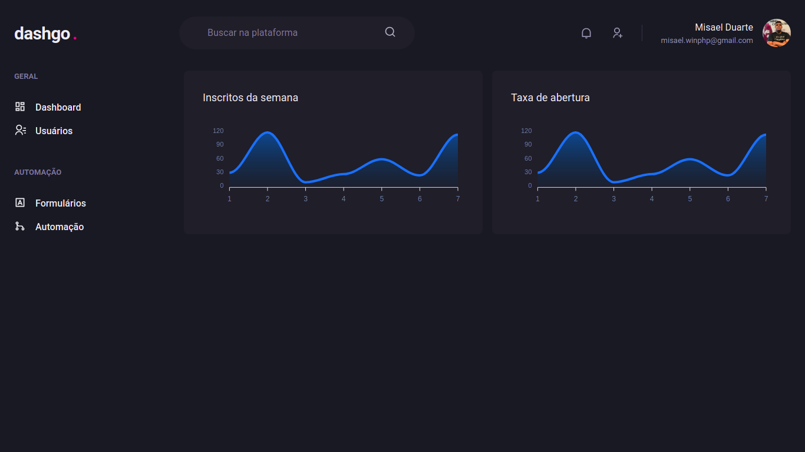

# Dashgo. project react

### Chakra_ui

### Description
> Projeto feito em react, utilizando a lib Chakra_ui como interface declarativa, e apexcharts para criação dos gráficos, a ideia é criar um dashboard para gerenciamento de usuários.

### Subscribers Dashboard
